

Microsoft/Azure -> <a href="https://learn.microsoft.com/en-us/users/klavrynenko/transcript/vnn82sp51q0q1e0?tab=credentials-tab">Full Transcript</a>

<table>
  <tr>
    <th width="10%">Badge</th>
    <th width="40%">Certification</th>
    <th width="15%">Earned</th>
    <th width="15%">Expires</th>
  </tr>
  <tr>
    <td></td>
    <td><a href="https://learn.microsoft.com/en-us/users/klavrynenko/credentials/624eb46a8492c982">AZ-305 Azure Solutions Architect Expert</a></td>
    <td>2021-05-08</td>
    <td>2027-05-09</td>
  </tr>
  <tr>
    <td></td>
    <td><a href="https://learn.microsoft.com/en-us/users/klavrynenko/credentials/6689e53e42ee2927">SC-100 Cybersecurity Architect Expert</a></td>
    <td>2022-08-25</td>
    <td>2026-08-26</td>
  </tr>
  <tr>
    <td></td>
    <td><a href="https://learn.microsoft.com/en-us/users/klavrynenko/credentials/b26fd6bde09437cd">AZ-400 DevOps Engineer Expert</a></td>
    <td>2020-07-28</td>
    <td>2027-05-26</td>
  </tr>
  <tr>
    <td>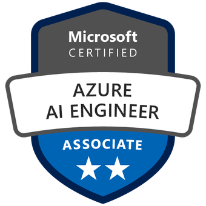</td>
    <td><a href="https://learn.microsoft.com/en-us/users/klavrynenko/credentials/f4e1d290d477033">AI-102 Azure AI Engineer Associate</a></td>
    <td>2026-05-20</td>
    <td>2027-05-21</td>
  </tr>
  <tr>
    <td>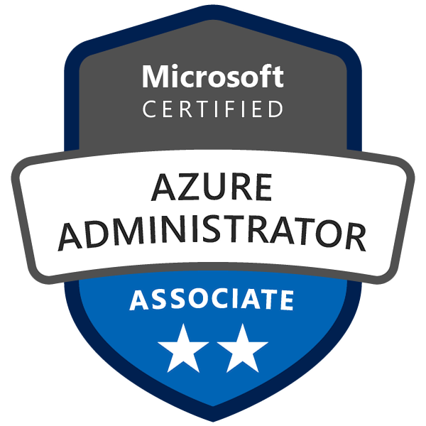</td>
    <td><a href="https://learn.microsoft.com/en-us/users/klavrynenko/credentials/dbd184d8966b049a">AZ-104 Azure Administrator Associate</a></td>
    <td>2020-02-25</td>
    <td>2027-02-26</td>
  </tr>
  <tr>
    <td></td>
    <td><a href="https://learn.microsoft.com/en-us/users/klavrynenko/credentials/5f09e8bc50591f75">AZ-500 Azure Security Engineer Associate</a></td>
    <td>2021-06-25</td>
    <td>2027-06-26</td>
  </tr>
  <tr>
    <td></td>
    <td><a href="https://learn.microsoft.com/en-us/users/klavrynenko/credentials/a3ade428b1f81db5">SC-300 Identity and Access Administrator Associate</a></td>
    <td>2025-08-02</td>
    <td>2026-08-03</td>
  </tr>
  <tr>
    <td>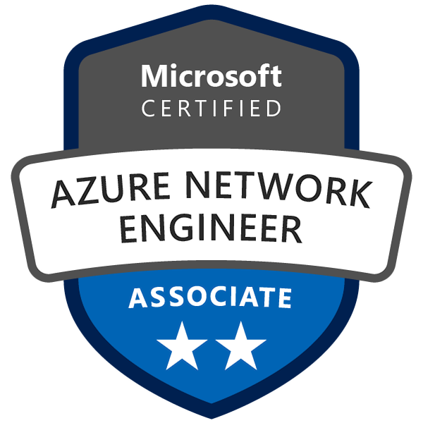</td>
    <td><a href="https://learn.microsoft.com/en-us/users/klavrynenko/credentials/7bf645405c25fd06">AZ-700 Azure Network Engineer Associate</a></td>
    <td>2025-07-06</td>
    <td>2027-07-07</td>
  </tr>
  <tr>
    <td>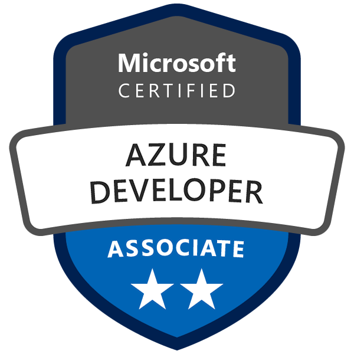</td>
    <td><a href="https://learn.microsoft.com/en-us/users/klavrynenko/credentials/9e029a64fa117785">AZ-204 Azure Developer Associate</a></td>
    <td>2022-10-30</td>
    <td>2026-10-31</td>
  </tr>
  <tr>
    <td>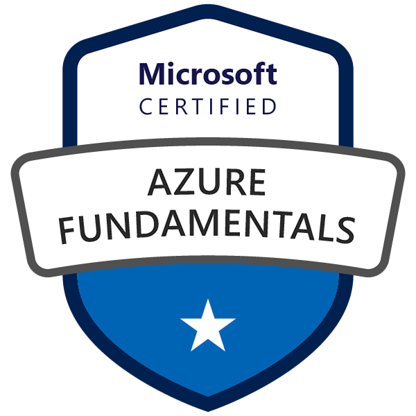</td>
    <td><a href="https://learn.microsoft.com/en-us/users/klavrynenko/credentials/7618a65d05937c3c">AZ-900 Azure Fundamentals</a></td>
    <td>2021-10-31</td>
    <td>Lifetime</td>
  </tr>
  <tr>
    <td></td>
    <td><a href="https://learn.microsoft.com/en-us/users/klavrynenko/credentials/574932aece126a15">SC-900 Security, Compliance, and Identity Fundamentals</a></td>
    <td>2022-09-01</td>
    <td>Lifetime</td>
  </tr>
  <tr>
    <td>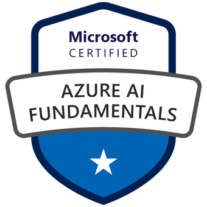</td>
    <td><a href="https://learn.microsoft.com/en-us/users/klavrynenko/credentials/c078bc8615005cd3">AI-900 Azure AI Fundamentals</a></td>
    <td>2024-04-28</td>
    <td>Lifetime</td>
  </tr>
  <tr>
    <td>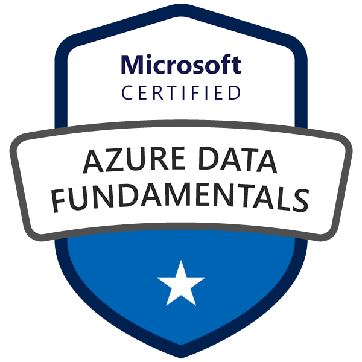</td>
    <td><a href="https://learn.microsoft.com/en-us/certifications/azure-data-fundamentals/">DP-900 Azure Data Fundamentals</a></td>
    <td>2023-10-12</td>
    <td>Lifetime</td>
  </tr>
  <tr>
    <td>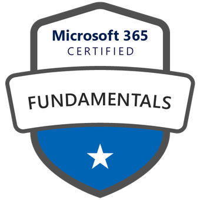</td>
    <td><a href="https://learn.microsoft.com/en-us/users/klavrynenko/credentials/3cc8abbf7b06a206">MS-900 Microsoft 365 Certified: Fundamentals</a></td>
    <td>2024-03-21</td>
    <td>Lifetime</td>
  </tr>
  <tr>
    <td>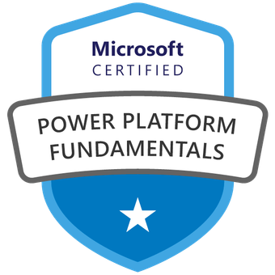</td>
    <td><a href="https://learn.microsoft.com/en-us/users/klavrynenko/credentials/3cc8abbf7b06a206">PL-900 Power Platform Fundamentals</a></td>
    <td>2024-02-19</td>
    <td>Lifetime</td>
  </tr>
  <tr>
    <td></td>
    <td><a href="https://www.credly.com/badges/190a98d2-cdc5-48c0-8800-7ff93ff26a46/public_url">MCSE: Cloud Platform and Infrastructure — Certified 2016</a></td>
    <td>2016-09-26</td>
    <td>Lifetime</td>
  </tr>
  <tr>
    <td></td>
    <td><a href="https://www.credly.com/badges/927b2b9b-3cf4-4830-adff-6c039deb42af/public_url">MCSA: Windows Server 2012 - Certified 2016</a></td>
    <td>2014-04-03</td>
    <td>Lifetime</td>
  </tr>
</table>

Amazon/AWS

<table>
  <tr>
    <th width="10%">Badge</th>
    <th width="40%">Certification</th>
    <th width="15%">Earned</th>
    <th width="15%">Expires</th>
  </tr>
  <tr>
    <td>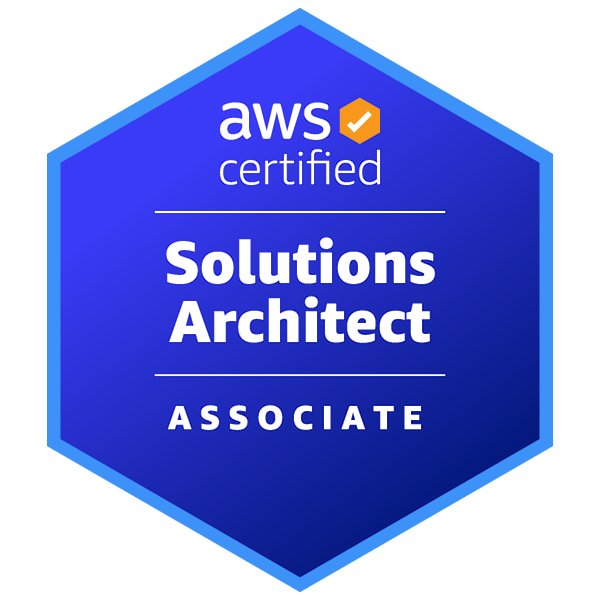</td>
    <td><a href="https://www.credly.com/badges/bfa81d47-fdbf-4e2e-955e-937053f59627/public_url">AWS Certified Solutions Architect – Associate</a></td>
    <td>2024-09-15</td>
    <td>2027-09-15</td>
  </tr>
  <tr>
    <td>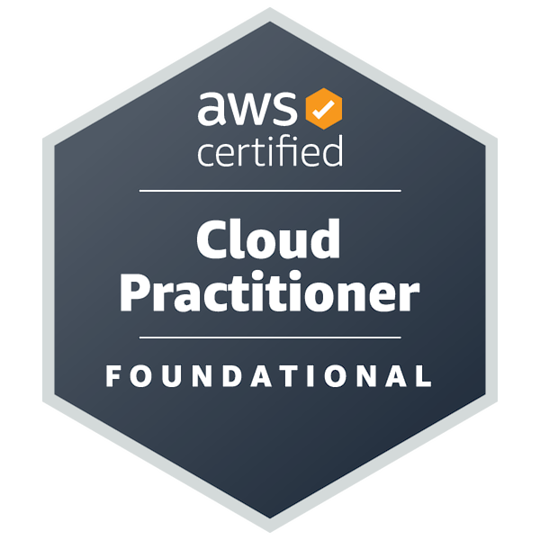</td>
    <td><a href="https://www.credly.com/badges/3d3ea2e2-dd2e-44bc-826c-4bb3d29a97a2/public_url">AWS Certified Cloud Practitioner</a></td>
    <td>2024-07-20</td>
    <td>2027-09-15</td>
  </tr>
</table>

Google/GCP

<table>
  <tr>
    <th width="10%">Badge</th>
    <th width="40%">Certification</th>
    <th width="15%">Earned</th>
    <th width="15%">Expires</th>
  </tr>
  <tr>
    <td>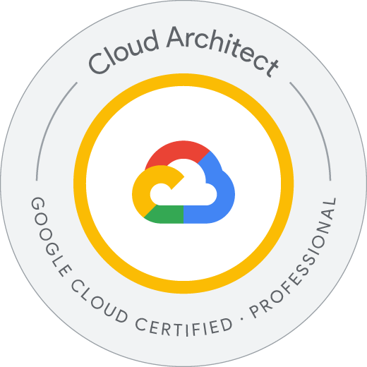</td>
    <td><a href="https://www.credly.com/badges/581763d6-9658-4338-8c5b-a2ff5c0c85a7">Professional Cloud Architect Certification</a></td>
    <td>2023-09-11</td>
    <td>2025-09-11</td>
  </tr>
  <tr>
    <td></td>
    <td><a href="https://www.credly.com/badges/61d9423a-8f19-466b-87bc-11d8a59608e9">Associate Cloud Engineer Certification</a></td>
    <td>2020-06-18</td>
    <td>2027-06-18</td>
  </tr>
</table>

The Linux Foundation

<table>
  <tr>
    <th width="10%">Badge</th>
    <th width="40%">Certification</th>
    <th width="15%">Earned</th>
    <th width="15%">Expires</th>
  </tr>
  <tr>
    <td>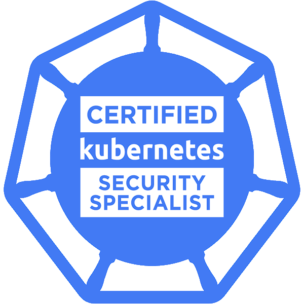</td>
    <td><a href="https://www.credly.com/badges/0adbd867-5667-425b-bead-f9865e2debb6/public_url">CKS: Certified Kubernetes Security Specialist</a></td>
    <td>2022-07-13</td>
    <td>2024-07-13</td>
  </tr>
  <tr>
    <td>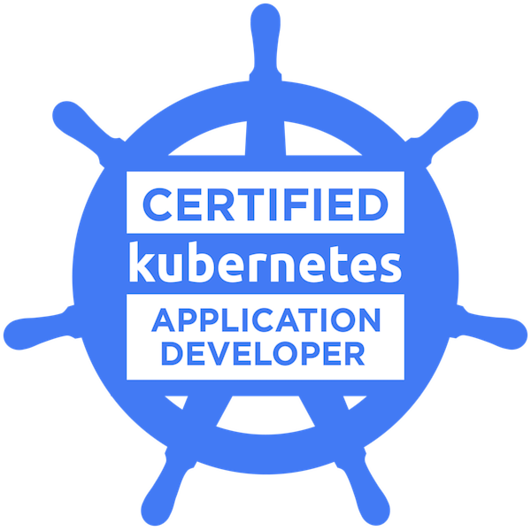</td>
    <td><a href="https://www.credly.com/badges/e1273a43-0695-4272-a6bc-1db3560fed84/public_url">CKAD: Certified Kubernetes Application Developer</a></td>
    <td>2022-01-07</td>
    <td>2025-01-07</td>
  </tr>
  <tr>
    <td>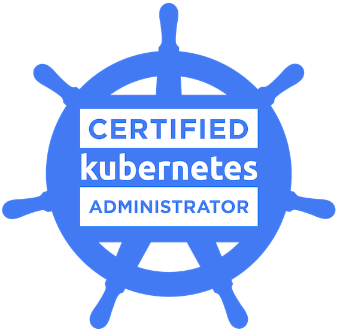</td>
    <td><a href="https://www.credly.com/badges/fb25bda2-8c53-43f6-ad0f-4a1e6ac70081/public_url">CKA: Certified Kubernetes Administrator</a></td>
    <td>2020-06-27</td>
    <td>2023-06-27</td>
  </tr>
  <tr>
    <td>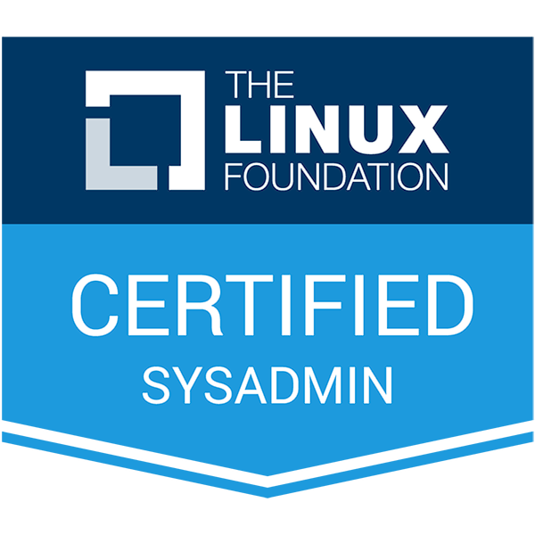</td>
    <td><a href="https://www.credly.com/badges/7f546f3e-1556-44aa-b9ab-44c328310e75/public_url">LFCS: Linux Foundation Certified Systems Administrator</a></td>
    <td>2023-12-09</td>
    <td>2026-12-09</td>
  </tr>
  <tr>
    <td>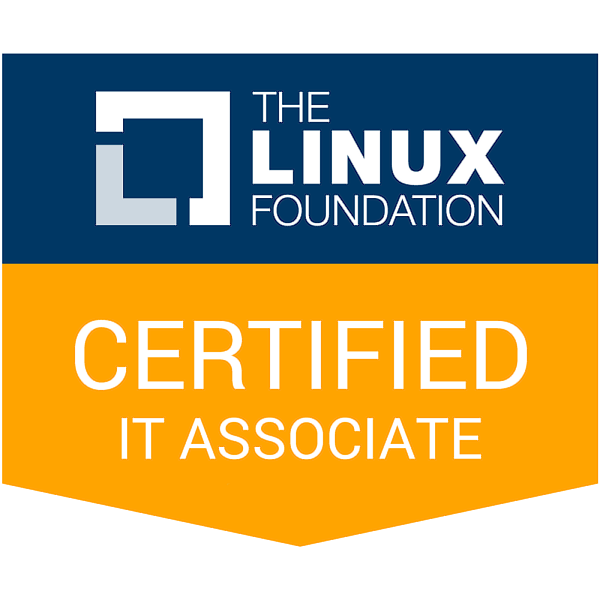</td>
    <td><a href="https://www.credly.com/badges/fcc0f05c-db1e-47ad-acc7-5115a78a50c7/public_url">LFCA: Linux Foundation Certified IT Associate</a></td>
    <td>2023-10-01</td>
    <td>2026-10-01</td>
  </tr>
  <tr>
    <td>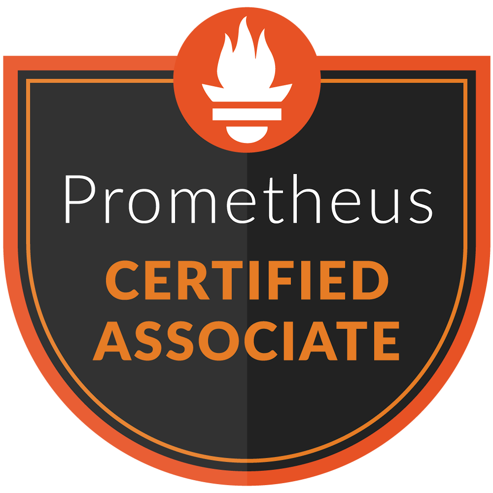</td>
    <td><a href="https://www.credly.com/badges/7f47c7be-3c7b-42ff-a79a-6c2050a0c082/public_url">PCA: Prometheus Certified Associate</a></td>
    <td>2023-01-08</td>
    <td>2026-01-08</td>
  </tr>
</table>

Platform Engineering

<table>
  <tr>
    <th width="10%">Badge</th>
    <th width="40%">Certification</th>
    <th width="15%">Earned</th>
    <th width="15%">Expires</th>
  </tr>
  <tr>
    <td>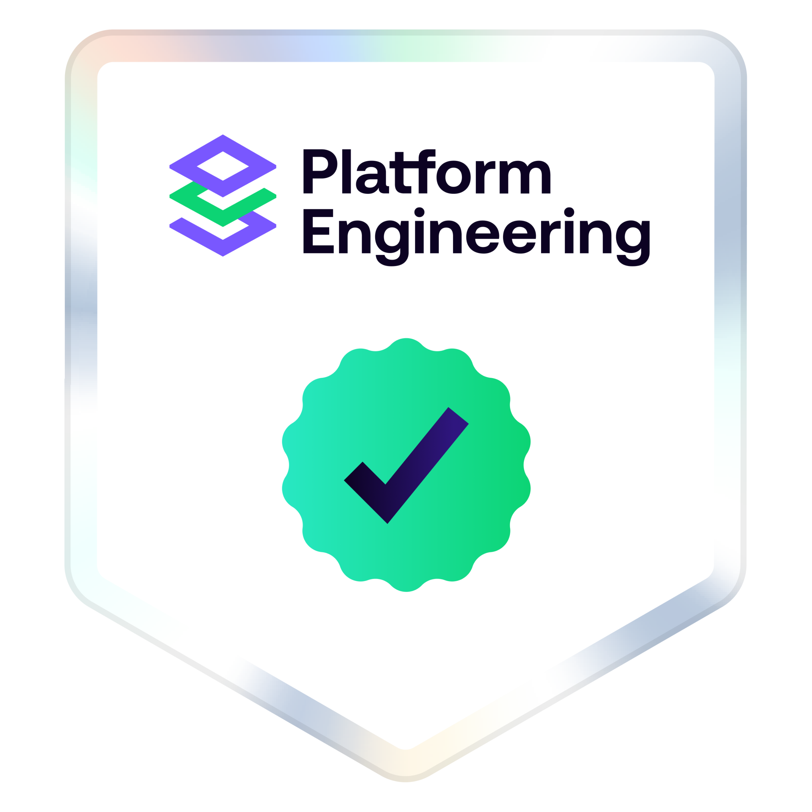</td>
    <td><a href="https://www.virtualbadge.io/certificate-validator?credential=eee78eca-5b95-46a4-9ecb-1e4731eb0d39">Introduction to Platform Engineering</a></td>
    <td>2026-05-21</td>
    <td></td>
  </tr>
  <tr>
    <td>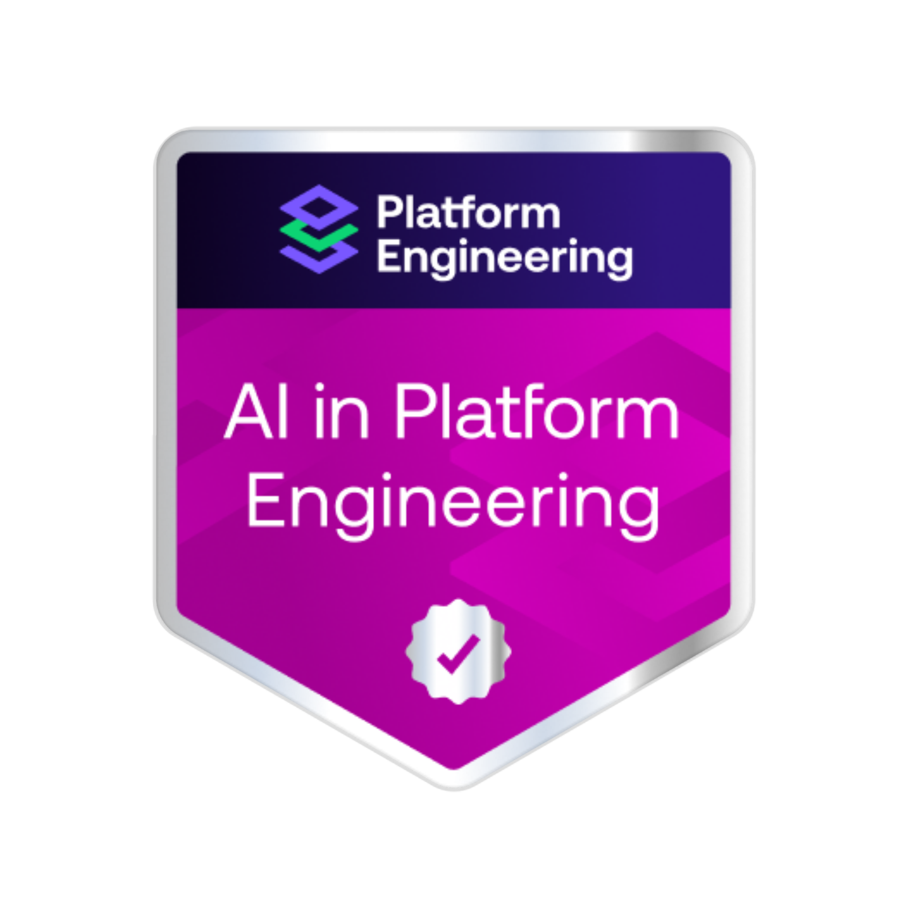</td>
    <td><a href="https://www.virtualbadge.io/certificate-validator?credential=ddbc2878-d2f6-41f7-afb1-60dd3fee715e">Intro to AI in platform engineering</a></td>
    <td>2026-05-22</td>
    <td></td>
  </tr>
</table>

